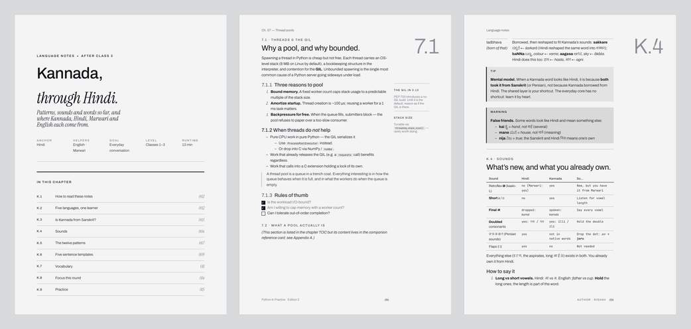
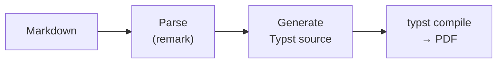

# rv-markdown-paper

Turn a Markdown file into a PDF that looks like a page from a well-made book.

```bash
npm run mdpdf -- notes.md notes.pdf
```



## Why

Markdown is pleasant to write, but turning it into a PDF usually gives you one of two things: a printed web page, or a LaTeX project. A printed web page has the wrong margins, no running headers, and footnotes that float away. LaTeX gets the typography right, but asks you to learn LaTeX.

rv-markdown-paper takes the Markdown you already write and sets it in a fixed editorial design: a cover page, running headers, page numbers, margin notes, footnotes, callouts, figures, equations and tables. You choose a paper colour. Fonts, sizes, spacing and layout are fixed, so every document comes out consistent.

## Quick start

You need [Node.js](https://nodejs.org) 20+ and [Typst](https://typst.app) 0.14+.

```bash
brew install node typst
git clone https://github.com/rvs-23/rv-markdown-paper.git
cd rv-markdown-paper
npm install

npm run mdpdf -- examples/kannada-notes/notes.md out/notes.pdf
```

To use it from any folder, link it once. That gives you a global `mdpdf` command:

```bash
npm link
cd ~/Documents/notes
mdpdf chapter.md chapter.pdf
```

The global command runs the built code, so after pulling changes run `npm install` in the repo to rebuild.

## Everyday options

```bash
# Warm gold paper, footer signed "AUTHOR · RV"
npm run mdpdf -- notes.md out/notes.pdf --paper-bg parchment --author "Rv"

# No author signature, US Letter, no cover page
npm run mdpdf -- notes.md out/notes.pdf --no-author --page-size Letter --no-cover
```

| Flag | What it does |
|---|---|
| `--paper-bg` | Page colour: `glacier` (white), `platinum` (grey, the default), `parchment` (gold), or any `#RRGGBB` |
| `--author "Name"` | Signs the footer with the first name: `AUTHOR · NAME` |
| `--no-author` | Leaves the signature out |
| `--watermark "Draft"` | Sets faint text across every page |
| `--page-size` | `A4` (default) or `Letter` |
| `--no-cover` / `--no-header` / `--no-footer` | Turn off the cover page, running header or footer |

The same settings can sit at the top of the Markdown file, so a plain `npm run mdpdf -- notes.md notes.pdf` picks them up:

```yaml
---
title: "Kannada, through Hindi"
author: "Rishav Sharma"
paperBg: parchment
---
```

[docs/configuration.md](docs/configuration.md) lists every option.

## Writing a document

Write ordinary Markdown. A few additions give you the rest of the design:

```markdown
## 7.1 · Threads
### Why a pool helps

:::tip
A tinted callout.
:::

:::margin
**Aside.** A note in the right margin.
:::
```

`##` sets a small section label, and its number (`7.1`) appears large in the margin. `###` is the heading readers see. The `:::` blocks become callouts and margin notes.

[docs/markdown-guide.md](docs/markdown-guide.md) shows every feature: the Markdown to write and what it becomes. It's written to be handed to a person or an AI agent drafting a document for this tool.

## How it works



The converter parses Markdown, checks it, and writes Typst source that calls a design template. Typst then sets the pages using only fonts bundled in this repo, so the same file gives the same PDF on any machine with the same Typst version.

## Documentation

- [Architecture](docs/architecture.md): how the pieces fit, and where to change what
- [Pipeline](docs/pipeline.md): each step from Markdown to PDF
- [Design system](docs/design-system.md): type, fonts, colours, page layout, components
- [Configuration](docs/configuration.md): every option, the config file, and the library API
- [Development](docs/development.md): setup, tests, and how to change rendering safely
- [Markdown guide](docs/markdown-guide.md): the syntax reference for writers

## License

MIT
