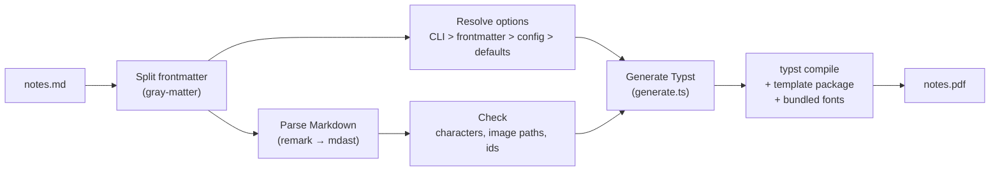

# Architecture

How a Markdown file becomes a PDF, and where each step lives in the code. Read this first; the other docs go deeper on one part each.

## Contents

- [At a glance](#at-a-glance)
- [The pipeline](#the-pipeline)
- [Repository map](#repository-map)
- [Why it is built this way](#why-it-is-built-this-way)
- [Where to change what](#where-to-change-what)
- [Gotchas](#gotchas)
- [Other docs](#other-docs)

## At a glance

The converter is a TypeScript program that writes Typst source and hands it to the Typst compiler. The TypeScript code only marks *what* is on the page: a heading, a table, a callout. The Typst template sets *how* each one looks. All styling is in the template.



One render takes about a second for a 17-page document. Most of that is Typst.

## The pipeline

[`src/core/convert.ts`](../src/core/convert.ts) runs these steps in order. [pipeline.md](pipeline.md) covers each one in detail.

1. **Read and split.** `gray-matter` separates the YAML frontmatter from the Markdown body.
2. **Resolve options.** Each option comes from the first layer that sets it: CLI flags, then frontmatter, then `mdpdf.config.json`, then built-in defaults. Every layer is validated, so a bad value fails here with the field named.
3. **Parse.** remark turns the body into an mdast tree (Markdown's syntax tree). Extra passes add what remark lacks: Pandoc attributes (`{#id .class}`), bracketed spans, and reference links.
4. **Check.** Before Typst runs, the converter rejects malformed ids (while parsing), characters no bundled font can draw, and image paths outside the document's folder (while generating).
5. **Generate.** [`generate.ts`](../src/typst/generate.ts) walks the tree and writes Typst markup that calls the template's functions (`#note[...]`, `#md-table(...)`).
6. **Compile.** [`render.ts`](../src/typst/render.ts) pipes that source into `typst compile`, with the template loaded as a local Typst package and only the bundled fonts available.

## Repository map

```text
src/
  cli/index.ts          Command-line flags → one options layer
  index.ts              Library entry: convertMarkdownToPdf + types
  core/
    convert.ts          Runs the pipeline end to end
    readingTime.ts      "13 min" estimate for the cover
  config/
    options.ts          Option types, defaults, paper presets
    validate.ts         Checks one layer (CLI, frontmatter or config file)
    resolve.ts          Merges the layers by precedence
  parser/
    frontmatter.ts      YAML split
    parseMarkdown.ts    remark setup, Pandoc pre-pass, reference links
    attributes.ts       {#id .class key=value} on headings, images, code, math
    spans.ts            [text]{.muted} bracketed spans
  typst/
    generate.ts         mdast → Typst markup
    escape.ts           Escaping for Typst markup and strings
    fonts.ts            Reads font coverage; rejects uncovered characters
    render.ts           Spawns typst compile
typst/local/mdpaper/0.1.0/
  template.typ          The design: page, type, components
  palette.typ           Colours, derived from the paper colour
  theme.tmTheme         Grayscale code highlighting
assets/fonts/           Every font the PDF can use, with licences
examples/               Demo documents and their committed PDFs
tests/                  Unit, snapshot and render tests
docs/                   This documentation
```

## Why it is built this way

**Typst instead of a browser or LaTeX.** Typst is a single binary that compiles in well under a second and has a real programming language for layout. A headless browser prints web pages, so page-level typography (running headers, margin notes, footnotes) fights CSS print support. LaTeX can do all of it, but its toolchain is large and its error messages are hard to act on.

**The template as a Typst package.** Typst only reads files inside its `--root` folder, which is set to the Markdown file's folder so a document can't read anything outside its own tree. The template has to live elsewhere, and Typst's local-package mechanism is the supported way to load code from outside the root. Typst requires local packages to sit at `<package-path>/<namespace>/<name>/<version>/`, which is why the template lives in `typst/local/mdpaper/0.1.0/`. The `0.1.0` is the package's own version. Only this tool loads the package, so it never has to change.

**Bundled fonts only.** Typst runs with `--ignore-system-fonts --ignore-embedded-fonts`, so the PDF can only use fonts from `assets/fonts/`. The same input gives a byte-identical PDF on any machine with the same Typst version. The committed-PDF check in [development.md](development.md#committed-pdfs) relies on that.

**Fail before rendering.** Typst draws a missing glyph as nothing and exits successfully. So the converter checks everything it can before Typst runs, and stops with a message that names the problem and its line.

## Where to change what

| To change... | Edit |
|---|---|
| How something looks (spacing, sizes, colours, a component) | [`template.typ`](../typst/local/mdpaper/0.1.0/template.typ) |
| The paper colours or derived tones | [`palette.typ`](../typst/local/mdpaper/0.1.0/palette.typ), and `PAPER_PRESETS` in [`options.ts`](../src/config/options.ts) for names |
| What Markdown turns into | [`generate.ts`](../src/typst/generate.ts) |
| New Markdown syntax | [`parseMarkdown.ts`](../src/parser/parseMarkdown.ts) or a pass beside it in `src/parser/` |
| A new option | `options.ts`, `validate.ts`, `resolve.ts`, the CLI, `render.ts` (the preamble), and the template's `paper(...)` parameters |
| Fonts | Add the files to `assets/fonts/`; Typst picks fallbacks automatically |

After any change to rendering, re-render the committed example PDFs in the same commit. [development.md](development.md) explains why and how.

## Gotchas

- **Inline Typst calls end with `;`.** Text glued to a call (`~~x~~(y)`) would otherwise extend the call. The generator adds the `;` everywhere; keep doing so for new inline output.
- **Escaping happens in one place.** [`escape.ts`](../src/typst/escape.ts) holds the only markup and string escapers. Text that skips them can inject Typst code.
- **`$…$` math runs in Typst's math mode,** where `#` starts code. The converter rejects raw `#` and `"` in math for that reason.
- **The example chapter's page count is a contract.** `examples/editorial-swiss/paper.md` must render to exactly 6 pages, and a test checks it.

## Other docs

- [pipeline.md](pipeline.md): each pipeline step in detail
- [design-system.md](design-system.md): the template, fonts, colours and page layout
- [configuration.md](configuration.md): every option, the config file, and the library API
- [development.md](development.md): setup, tests, and how to change rendering safely
- [markdown-guide.md](markdown-guide.md): the syntax reference for writing documents
