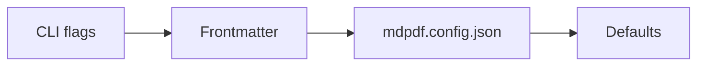

# Pipeline

Each step from Markdown file to PDF, in the order [`convert.ts`](../src/core/convert.ts) runs them. [architecture.md](architecture.md) has the overview.

## Contents

- [1. Options](#1-options)
- [2. Parsing](#2-parsing)
- [3. Checks before rendering](#3-checks-before-rendering)
- [4. Generating Typst](#4-generating-typst)
- [5. Compiling](#5-compiling)

## 1. Options

Options arrive in up to four layers. For each option, the first layer that sets it wins:



[`validate.ts`](../src/config/validate.ts) checks each layer on its own, so an error names the layer and field: `frontmatter.paperBg: expected glacier, platinum, parchment, or a #RRGGBB hex color, got "gold".` Paper preset names become hex codes here, so later steps only ever see `#RRGGBB`.

Unknown keys are handled differently per layer. In `mdpdf.config.json` they are errors, because that file holds nothing else. In frontmatter they are ignored, since notes carry keys for other tools (`tags`, `aliases`), unless the key is within two letters of a real option (`showheader`, `titel`). Those print a "did you mean" warning.

[`resolve.ts`](../src/config/resolve.ts) merges the layers. Two adjustments follow in `convert.ts`:

- **The leading H1 is dropped** when a cover is shown (the cover carries the title), or when the H1 repeats the `title` option.
- **Reading time** is estimated at 230 words a minute when the document has a title or cover and no `readingTime` was given. With a cover, it is added to the cover's meta row as "Runtime" unless the author already wrote one.

## 2. Parsing

[`parseMarkdown.ts`](../src/parser/parseMarkdown.ts) turns the body into an mdast tree with remark and four plugins: GitHub-flavoured Markdown, directives (`:::note`), math (`$…$`) and definition lists.

Only the block forms of directives are on. The inline form, `:name`, is switched off: it read ordinary text such as `5:45` or `key:value` as a directive, and the text after the colon disappeared.

The source is written in a Pandoc-flavoured dialect that remark doesn't fully understand, so six passes run around the parse.

**Before the parse:**

- Obsidian `%%comments%%` are removed. A comment hides whatever it contains, so this happens on the source: after the parse, a link or bold text inside a comment would split it into pieces. Code blocks and code spans are left alone.
- `::: name` and `:::{.name key="v"}` are rewritten into remark-directive's form, `:::name{key="v"}`.

**After the parse:**

- [`spans.ts`](../src/parser/spans.ts) turns `[text]{.muted}` into span nodes. It works on text nodes only, so code and math are untouched, and it checks the original source so an escaped `\[` never opens a span.
- [`obsidian.ts`](../src/parser/obsidian.ts) rewrites Obsidian's own syntax into nodes the generator already handles: `> [!tip]` callouts become callouts, `[[wikilinks]]` become their text, `![[image.png]]` becomes an image, and `==highlights==` become highlight nodes.
- Reference links (`[text][ref]` with `[ref]: url` elsewhere) are rewritten into ordinary links and images, and the definitions are dropped.
- [`attributes.ts`](../src/parser/attributes.ts) moves `{#id .class key=value}` bundles off the end of headings, images, display math and code-fence info strings onto the node. Ids must match `^[A-Za-z][A-Za-z0-9_:-]*$`; anything else is an error, because an id becomes a Typst label.

## 3. Checks before rendering

The converter rejects these before Typst runs:

| Check | Where | Why |
|---|---|---|
| Every character has a font | [`fonts.ts`](../src/typst/fonts.ts) | Typst draws an uncovered character as nothing. The check reads the `cmap` table of every bundled font and lists each uncovered character with its code point and line. |
| Images are local files inside the document's folder | `resolveImagePath` in [`generate.ts`](../src/typst/generate.ts) | URLs, `data:` URIs, absolute paths and `../` escapes are rejected, so a document can't read files elsewhere on the machine. |
| Math has no raw `#` or `"` | `latexToTypst` in `generate.ts` | In Typst math mode `#` starts code, and `"` could close a string early. |
| Footnotes don't reference themselves | `generate.ts` | Page footnotes are inlined where they're referenced, so a cycle would recurse forever. |

## 4. Generating Typst

[`generate.ts`](../src/typst/generate.ts) walks the tree and writes Typst markup. Most nodes map directly onto a template function, such as `:::tip` to `#tip[...]`. These parts take more work.

**Headings and page layout.** `##` is a small uppercase section label and `###` is the large visible title. An `##` that starts with a section number (`7.1 · Threads`, `K.2 · …`) also sets the large numeral in the right margin. `{#chapter-opener}` starts an opening page in the wider no-rail column, and the next `##` returns to the normal layout on a fresh page. `{.pagebreak}` starts any section on a new page.

**The margin rail.** `usesRail` checks whether anything will be drawn in the right margin: a `:::margin` note or a numbered `##`. If nothing will, the text column widens instead of leaving an empty band. [design-system.md](design-system.md#page-geometry) has the numbers.

**Tables.** Each table becomes `#md-table(header, rows, words)`. The template measures every cell in its real font and sizes the columns from that. Typst can't split content into words, so the generator passes each column's longest word, which sets the minimum width a column needs to avoid breaking a word.

**Footnotes.** By default each `[^x]` becomes a Typst footnote at the bottom of its page. With `footnotes: endnotes`, references become numbered superscripts and every note is collected into a NOTES block at the end, including notes that are defined but never referenced.

**Cross-references.** `[@fig:x]` and `[@eq:y]` become Typst references ("Fig. 1", "(1)"). A reference to a label that doesn't exist stays as plain text, because Typst would otherwise fail on it.

**Math.** `$…$` is LaTeX, converted to Typst math by [`tex2typst`](https://github.com/qwinsi/tex2typst) in strict mode, so an unknown command fails with the formula named. The standard operators (`\max`, `\det` and the rest), which strict mode doesn't know, are passed through as Typst's own.

**Mermaid.** Before generating, [`mermaid.ts`](../src/core/mermaid.ts) draws every `mermaid` block with mermaid-cli (`mmdc`), all in one run because each run starts a headless browser. Labels are drawn as plain SVG text in Archivo, since Typst can't draw HTML labels, and the SVG goes into the Typst source as a string, so no file is written beside the document. mermaid-cli isn't a dependency: without it the blocks print as code, with a warning.

**Escaping.** Text goes through [`escape.ts`](../src/typst/escape.ts), which escapes every character Typst markup would read as syntax (`*`, `_`, `#`, `$`, `@`, `<`, `~`, `/` and more). It also escapes `=`, `-`, `+` and `N.` at the start of a line, where Typst would read a heading or list.

**Inline calls.** Inline output such as `#strike[...]` or `#link(...)[...]` always ends with `;`. Without it, text that directly follows (`~~x~~(y)`) would be read as part of the call.

## 5. Compiling

[`render.ts`](../src/typst/render.ts) builds a short preamble (imports from the template package, then `#show: paper.with(...)` carrying every option) and pipes preamble plus body into Typst on stdin:

```bash
typst compile \
  --root <markdown folder> \
  --package-path typst \
  --font-path assets/fonts \
  --ignore-system-fonts --ignore-embedded-fonts \
  --creation-timestamp 0 \
  --input paper-bg=#F5EEDD \
  - output.pdf
```

- `--root` limits Typst's file access to the document's own folder. That's where images are read from.
- Reading from stdin means nothing is written next to your Markdown, so read-only folders work.
- `--creation-timestamp` pins the PDF's dates and its document id. It honours `SOURCE_DATE_EPOCH` and defaults to `0`, so the same input gives the same bytes.
- `--input paper-bg` only appears when a paper colour is set. The palette reads it with `sys.inputs`.

If Typst fails, its error output becomes the thrown error. Only the last 64 KB is kept, so a runaway compile can't fill memory.
