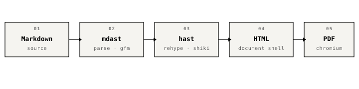

Most document generators optimize for **visual variety** — icons, gradients,
accent palettes, rounded corners, illustrated divider graphics. This one
does not. It aims to produce *the same kind of page, over and over*, with
as little chrome as the content will tolerate. The reference points, if any,
are the [Manutius pocket editions](https://en.wikipedia.org/wiki/Aldus_Manutius),
the [Penguin Rules of Composition](https://www.penguin.co.uk/), and the
long shelf of technical manuals that quietly just work.

## Why

The point of a printed page is **to be read**.

- Every extra color is a decision the reader has to resolve.
- Every rounded corner is a style choice the reader has to *accept or ignore*.
- Every shadow is an attempt to imitate paper that paper itself does not need.

When those decisions aren't yours to make, the reader can just read. See
[*The Elements of Typographic Style*](https://en.wikipedia.org/wiki/The_Elements_of_Typographic_Style)
for the long version of this argument — or the much shorter version in
Matthew Butterick's [*Typography for Lawyers*](https://typographyforlawyers.com).

## What You Get

| Element     | Treatment                                              |
|-------------|--------------------------------------------------------|
| H1          | IBM Plex Serif 700, ink-black, double rule below       |
| H2–H4       | Same serif family, tighter hierarchy                   |
| Body        | Lora 10.5pt, 1.46 leading, true-italic for emphasis    |
| Code        | Warm off-white panel, mono, language tag top-right     |
| Tables      | Uppercase-mono header, no vertical borders             |
| Links       | Ink-black, underlined                                  |
| Callouts    | Three voices: note (plain), warn (rule), system (mono) |
| Header      | Section · Title · Date in IBM Plex Serif, uppercase    |
| Footer      | `page / total` in mono, centered                       |

## How

1. Extract frontmatter with `gray-matter`.
2. Parse Markdown to an mdast tree (`remark-parse` + `remark-gfm`).
3. Transform mdast → hast with `remark-rehype`, running a small
   `remarkCallouts` plugin along the way.
4. Syntax-highlight with `@shikijs/rehype` using a grayscale theme.
5. Stringify to HTML, wrap in a minimal shell, drive Chromium through
   Playwright, emit the PDF.

Nothing in that list is novel. The novelty, if any, is in what's left out.



## Code, For Flavor

```typescript
const { content, frontmatter } = extractFrontmatter(raw);
const resolved = resolveOptions({ cli, frontmatter, project });
const tree = parseMarkdownToMdast(content);
const body = await mdastToHtml(tree);
const html = wrapInDocumentShell(body, {
  title: resolved.title ?? deriveTitle(inputPath),
  baseUrl: pathToFileURL(dirname(inputPath) + "/").href,
});
```

One call per stage. No theme registry, no plugin API — if a second output
format ever arrives, we can add one then.

## Callouts

Three types, one source format — a `[!NOTE]`, `[!WARN]`, or `[!SYSTEM]`
tag on the first line of a blockquote.

> [!NOTE]
> Useful context that isn't load-bearing. A quiet aside the reader can
> take or leave.

> [!WARN]
> Something the reader must not miss. The left rule is enough signal;
> the tag above it is enough name.

> [!SYSTEM]
> A diagnostic, an engineering invariant, or a pre-condition. The mono
> face and the dashed rule together read as "from the machine, not the
> author" — without needing a label to say so.

## A Note on Checklists

- [x] ~~Five accent palettes.~~
- [x] Grayscale only — no accent color.
- [x] Header and footer in the same typographic voice.
- [x] Cover page with suppressed running header on page 1.
- [ ] Table of contents with real page numbers (next).

The strikethrough, task list, and nested list all render from a single
Markdown source — no special syntax, no escape hatches.

## Closing

> Design is a plan for arranging elements in such a way as best to
> accomplish a particular purpose.

— Charles Eames, who knew a thing or two about chairs.

---

If a boring page is readable, and a readable page gets read, the boring
page has out-performed the interesting one. That is the whole case.
