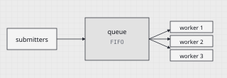

---
# ----------------------------------------------------------------------------
# Python in Practice — Ch. 07 "Thread pools"
# Pandoc markdown source. Target: Typst via `pandoc -t typst`.
#
# Relies on these Pandoc markdown features (all standard, enable in pandoc
# with: --from markdown+fenced_divs+bracketed_spans+attributes+definition_lists
#                 +task_lists+strikeout+yaml_metadata_block+tex_math_dollars
#                 +pipe_tables+footnotes):
#
#   :::name               fenced divs (class-only shorthand)
#   :::{.name k="v"}      fenced divs with arbitrary attributes
#   [text]{.class}        bracketed spans
#   ## Heading {#id}      heading IDs (native Pandoc)
#   ``` {.python k="v"}   code-block attributes (language + filename etc.)
#   {#fig:x}   figure refs (pandoc-crossref convention)
#   $$ ... $$ {#eq:x}     display-math refs (pandoc-crossref convention)
#
# Custom classes (.eyebrow, .dropcap, .exbox, .margin, .epigraph) are styled
# by the Typst template — no Pandoc extension needed; they round-trip as
# Typst `#block(..)` calls via the template's show rule on `<class>`.
# ----------------------------------------------------------------------------

chapter: 7
part: Two
edition: "Edition 2 · 2026"
volume: "Volume I"
page-start: 85
page-end: 98

cover:
  kicker: "Part Two · Chapter 07"
  title: "Thread pools, or how to share a bounded crew."
  subtitle: "From `threading.Thread` to `concurrent.futures` — when a pool helps, and when it just hides the problem."
  meta:
    Topic: "Thread pools & futures"
    Language: "Python 3.12"
    Runtime: "75 min read"
  # NOTE: `page` values are provisional. They match the mockup's page
  # numbering but will be replaced by Typst-side resolution via
  # `counter(page).at(label)` once section page-break policy lands
  # (commit 15 of the post-review plan). Do not hand-edit after
  # choreography changes — regenerate from labels instead.
  toc:
    - { id: "7.1", title: "Threads & the GIL",            ref: "sec-threads-gil", page: "086" }
    - { id: "7.2", title: "What a pool actually is",      ref: "sec-pool-is",     page: "088" }
    - { id: "7.3", title: "Submitting & collecting work", ref: "sec-submitting",  page: "090" }
    - { id: "7.4", title: "Sizing the pool",              ref: "sec-sizing",      page: "092" }
    - { id: "7.5", title: "Exercises",                    ref: "sec-exercises",   page: "094" }
    - { id: "7.6", title: "Further reading",              ref: "sec-further",     page: "096" }
---

# Thread pools {#ch-thread-pools}

## Introduction {#chapter-opener}

::: eyebrow
Ch. 7 · Introduction
:::

::: dropcap
A thread pool is a *bounded crew* of workers that take jobs from a shared
queue. You hand it a function and its arguments; it hands back a **future** —
a promise that the answer will be ready later. Pools solve two problems at
once: they cap how many threads exist, and they remove the cost of starting
a new one for every task.
:::

This chapter assumes you have seen `threading.Thread` but have not yet
reached [Ch. 8 · asyncio](#ch-asyncio). We stay deliberately in the
`concurrent.futures` module, which is the right tool for the overwhelming
majority of I/O-bound Python programs.[^cpu-process-pool]

##### What you will learn

Pool
:   A fixed-size set of worker threads that consume a work queue.

Future
:   An object representing a computation that may not yet have completed.

Executor
:   The object you submit work to; it owns the pool and the queue.

GIL
:   The Global Interpreter Lock; only one thread runs Python bytecode at a time.

##### A note on scope

We cover *thread* pools specifically. Process pools (`ProcessPoolExecutor`)
are touched on in §7.4 only to contrast sizing rules. ~~Async pools~~ are
deferred to chapter 8.

## 7.1 · Threads & the GIL {#sec-threads-gil}

### Why a pool, and why bounded.

Spawning a thread in Python is cheap but not free. Each thread carries an
OS-level stack (8 MB on Linux by default), a bookkeeping structure in the
interpreter, and contention for the **GIL**. Unbounded spawning is the single
most common cause of a Python server going sideways under load.

::: margin
**The GIL in 3.13.** PEP 703 introduces a no-GIL build. Until it is the
default, reason as if the GIL is there.
:::

::: margin
**Stack size.** Tunable via `threading.stack_size()` — rarely worth doing.
:::

#### 7.1.1 Three reasons to pool

1. **Bound memory.** A fixed worker count caps stack usage to a predictable
   multiple of the stack size.
2. **Amortize startup.** Thread creation is ~100 μs; reusing a worker for a
   1 ms task matters.
3. **Backpressure for free.** When the queue fills, submitters block — the
   pool refuses to paper over a too-slow consumer.

#### 7.1.2 When threads do *not* help

- Pure CPU work in pure Python — the GIL serializes it.
  - Use `ProcessPoolExecutor` instead.
  - Or drop into C via NumPy / `numba`.
- Work that already releases the GIL (e.g. a `requests` call) benefits
  regardless.
- Work that calls into a C extension holding a lock of its own.

> A thread pool is a queue in a trench coat. Everything interesting is in
> how the queue behaves when it is full, and in what the workers do when
> the queue is empty.

#### 7.1.3 Rules of thumb

- [x] Is the workload I/O-bound?
- [x] Am I willing to cap memory with a worker count?
- [ ] Can I tolerate out-of-order completion?

## 7.2 · What a pool actually is {#sec-pool-is}

*(This section is listed in the chapter TOC but its content lives in the
companion reference card; see Appendix A.)*

## 7.3 · Submitting & collecting work {#sec-submitting}

### The minimal executor.

The standard library ships `concurrent.futures.ThreadPoolExecutor`. It is a
context manager; entering it spins the workers, exiting it joins them.

::: margin
**Context manager.** Exiting the `with` block calls `shutdown(wait=True)`.
:::

``` {.python filename="fetch_all.py" lang-label="Python 3.12" #code-fetch-all}
from concurrent.futures import ThreadPoolExecutor, as_completed
import requests

urls = ["https://example.com/", "https://python.org/"]

def fetch(url: str) -> int:
    return requests.get(url, timeout=5).status_code

with ThreadPoolExecutor(max_workers=8) as ex:
    futures = {ex.submit(fetch, u): u for u in urls}
    for f in as_completed(futures):
        print(futures[f], f.result())
```

::: note
Use `as_completed` when order does not matter — results arrive in finish
order, not submit order. For submit order, iterate `ex.map` instead.
:::

::: tip
Wrap `f.result()` in `try/except`. Exceptions raised inside a worker are
deferred until you ask for the result.
:::

::: warning
Never `submit()` from inside a worker of the same pool — you can deadlock.
Use a separate pool, or just call the function directly.
:::

::: danger
Do not share an unsynchronised mutable (a `list`, `dict`) across workers.
The GIL protects bytecode, not your invariants.
:::

## 7.4 · Sizing the pool {#sec-sizing}

### How many workers?

{#fig:pool-queue}

::: margin
**Little's law.** Kleinrock 1975; applies to any stable queueing system.
:::

A reasonable default for I/O-bound work is given by Little's law:

$$ N = \lambda \cdot W $$ {#eq:little}

where *N* is the pool size, *λ* the arrival rate of requests, and *W* the
average time a worker spends per request (mostly blocked on I/O).

| Workload          | Good default | Ceiling | Why                 |
| :---------------- | -----------: | ------: | :------------------ |
| Local disk I/O    |        4 – 8 |      32 | Kernel queue depth  |
| HTTP calls        |       8 – 32 |     256 | Remote capacity     |
| DNS lookups       |           16 |      64 | Resolver cache      |
| Pure Python CPU   |            1 |       1 | GIL                 |

## 7.5 · Exercises {#sec-exercises}

### Work these before 7.6.

Model solutions are in Appendix C, pp. 342–346.

::: {.exbox number="01" tag="submit / result"}
**Warm-up.**
Using `ThreadPoolExecutor`, compute the length of ten URLs in parallel and
print them in *submission* order, not completion order.
:::

::: {.exbox number="02" tag="Little's law"}
**Sizing.**
A service receives 40 requests/second; each spends 0.6 s blocked on a
downstream API. Compute the pool size from equation [@eq:little].
Justify rounding up.
:::

::: {.exbox number="03" tag="deadlock"}
**Trap.**
Construct a program where a worker in pool *A* submits to the same pool and
waits on the result. Show the deadlock; fix it with two pools.
:::

::: epigraph
Concurrency is a way of organising code. Parallelism is a property of how
it runs.

— Rob Pike · *Concurrency is not parallelism* (2012)
:::

## 7.6 · Further reading {#sec-further}

::: margin
**See also.** Ch. 8 · asyncio; Ch. 9 · process pools.
:::

- **Kleinrock, L.** *Queueing Systems, Vol. 1.* Wiley, 1975.
- **Beazley, D.** *Python Concurrency From the Ground Up.* PyCon US, 2015.
- **CPython source** — `Lib/concurrent/futures/thread.py`.

[^cpu-process-pool]: For CPU-bound work, substitute `ProcessPoolExecutor`;
    the API is identical, the cost model is not.

[^as-completed-timeout]: The `as_completed` iterator accepts a `timeout=`
    keyword.
