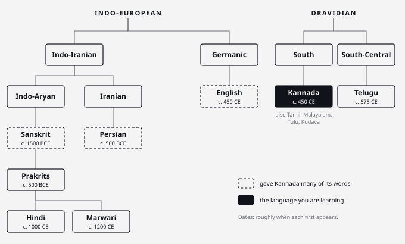

## Before you start {#chapter-opener}

:::eyebrow
Kannada · ಕನ್ನಡ · Notes after class 3
:::

:::dropcap
Kannada is not a cousin of Hindi. It belongs to a different language family. Even so, a Hindi speaker starts with a big advantage, because the two have lived side by side for thousands of years and picked up the same habits: the verb goes last, small endings do the work of को and से, and both took words from Sanskrit. These notes lean on that. Build the sentence in Hindi, swap in the Kannada words, and use English or Marwari wherever Hindi falls short.
:::

:::epigraph
ಎಲ್ಲಾದರು ಇರು, ಎಂತಾದರು ಇರು, ಎಂದೆಂದಿಗು ನೀ ಕನ್ನಡವಾಗಿರು.

*Wherever you are, however you are, always stay Kannada.*

— Kuvempu
:::

## K.1 · How to read these notes {#sec-key}

### Three spellings, one rule each.

:::margin
**Why Devanagari?** It already writes ड/द, ट/त, ण/न and आ/अ as different letters, so it spells Kannada sounds far better than English letters can.
:::

Every word appears up to three ways:

Kannada (Roman)
:   How you would type it on WhatsApp: *nodi, beku, oLage*. Use it to recognise the word, not to pronounce it.

Say it (देवनागरी)
:   The pronunciation. When the Roman and the Devanagari disagree, trust the Devanagari.

ಕನ್ನಡ
:   The Kannada script, for signs and menus. It spells the **spoken** form you will actually say, not the textbook form.

Two conventions run through everything:

- **Capital L = ळ**, the Marwari *kaalo-L* (see [Sounds](#sec-sounds)). A plain `l` (*mele, illa, alli*) is the ordinary ल. **LL** is a doubled ळ्ळ, as in *kootkoLLi*.
- **Every अ is spoken, even the last one.** Read वार as *vaa-ra*, never *vaar*. Hindi drops that final vowel; Kannada never does.

---

## K.2 · Five languages, one learner {#sec-history}

### Where each of my languages comes from.

You bring four languages to Kannada class: **Hindi**, **Marwari**, **English**, and the **Sanskrit** built into Hindi. A fifth, **Persian**, arrives quietly through words you already use. They come from two unrelated families.

{#fig:families}

#### Sanskrit, the classical donor

The oldest recorded Indo-Aryan language. The Rigveda was composed around 1500–1200 BCE and passed down orally for centuries. Pāṇini fixed its grammar around the 4th century BCE. For about two thousand years it was the language of learning across all of India, the Dravidian south included. That is how its words reached Kannada.

#### Hindi, Sanskrit's descendant

Sanskrit → the **Prakrits** (the spoken languages of the Buddha's and Mahavira's time) → **Apabhramsha** → **Old Hindi**, around the 10th–12th century. The Delhi dialect, *Khari Boli*, absorbed Persian and Arabic under the Sultanate and the Mughals and became **Hindustani**. In the 19th century that split into **Hindi** (Devanagari, leaning on Sanskrit) and **Urdu** (Perso-Arabic script, leaning on Persian). Hindi has been an official language of the Union since 1950.

#### Marwari, Hindi's sibling rather than its child

The language of Marwar (Jodhpur, Nagaur, Barmer). It grew out of **Old Western Rajasthani**, also called *Maru-Gurjari* (12th–16th century), which is also the parent of Gujarati. So Marwari sits *beside* Hindi on the family tree, not *under* it. Mirabai, from Merta in Marwar, sang in Rajasthani mixed with Braj. Marwari merchants kept their accounts in their own script, **Mahajani**. Marwari is not in the Eighth Schedule, so the census counts its speakers under Hindi.

:::margin
**Your ळ is Vedic.** The first line of the Rigveda, *agnim īḷe purohitam*, contains a ळ. Hindi lost the sound; Marwari, Marathi and Kannada kept it.
:::

Two Marwari sounds are exactly the ones Hindi lacks and Kannada needs: **ळ** (काळो, *black*) and heavy use of **ण** (पाणी, *water*).

#### English, the Germanic latecomer

:::margin
**Same century.** The Halmidi inscription (c. 450 CE) is two centuries older than the earliest English poem, Cædmon's Hymn (c. 670).
:::

Germanic tribes (the Angles, Saxons and Jutes) brought it to Britain in the 5th century CE, around when the first full Kannada inscription was carved. After the Norman conquest of 1066, French and Latin words flooded in (Middle English, Chaucer). Then came Early Modern English, the English of Shakespeare. It reached India with the East India Company (chartered 1600) and became the language of higher education after Macaulay's Minute of 1835. Today it is Kannada's newest source of words: *bus, phone, ticket*.

#### Persian, the quiet fifth

You don't speak it, but you know its words. Persian was the court language of the **Bahmani** and **Bijapur** sultanates in north Karnataka, and later of Hyder Ali and Tipu Sultan in Mysore. Kannada took words like **khaali, kaagada, baaki** from it, the same ones Hindi took via the Mughals. When a Kannada word sounds like Urdu, this is why.

#### Kannada, the Dravidian elder

Proto-Dravidian split into branches long before any of them was written down. Kannada is **South Dravidian**, with close cousins Tamil, Malayalam, Tulu and Kodava. Telugu is on the neighbouring **South-Central** branch. Like English, Kannada has an Old, a Middle and a Modern stage:

| Stage | When | Landmark |
| :--- | :--- | :--- |
| Pre-Old Kannada (*Purva Halegannada*) | 450–800 CE | **Halmidi inscription**, c. 450 CE: the first full sentence in Kannada[^halmidi] |
| Old Kannada (*Halegannada*) | 800–1200 | *Kavirajamarga* (c. 850), the oldest surviving book; Pampa's *Vikramarjuna Vijaya* (941) |
| Middle Kannada (*Nadugannada*) | 1200–1700 | **Basavanna's vachanas** (12th c.), poems in plain everyday Kannada, much like Kabir's dohas; Purandara Dasa (16th c.), the father of Carnatic music |
| Modern Kannada (*Hosagannada*) | 1700 → | Kuvempu, Bendre, Karanth: **8 Jnanpith Awards**, more than any other language except Hindi |

- **Script.** Brahmi → Kadamba → the shared *Kannada–Telugu* script, which split in two around the 13th–14th century. That is why the two scripts look alike. In Karnataka it is also used to write Tulu, Kodava and Konkani.
- **State.** Kannada-speaking regions were joined into one state on **1 November 1956**, now celebrated as *Kannada Rajyotsava*. The state was renamed Karnataka in 1973.
- **Status.** Declared a **Classical Language of India** in 2008, together with Telugu.
- **Spoken ≠ written.** Everyday Kannada and formal Kannada differ a lot. Written ಬರುತ್ತದೆ *baruttade* is spoken *baratte*. You are learning the spoken kind, which is the right choice for conversation.

#### Why your Hindi helps anyway

Unrelated languages that share a region for long enough start to share habits. Linguists call such a region a *sprachbund*, and South Asia is the textbook example.[^emeneau] Hindi and Kannada share ancestors only through loanwords, yet their sentences are built the same way:

| Habit | Hindi | Kannada |
| :--- | :--- | :--- |
| Verb goes last | ghar jaao | mane-ge hogi |
| Endings come after the noun, not before it (postpositions) | ghar **se** · ghar **mein** | mane**yinda** · mane**yalli** |
| "To me" is the subject | **mujhe** pasand hai | **nanage** ishta |
| A helper verb for "for yourself" | baith **lo** | koot**koLLi** |
| Echo words | chai-vai | tindi-gindi |
| Retroflex ड ट ण | yes | yes |

:::margin
**The trade ran both ways.** Many linguists think Sanskrit got ट ड ण from its Dravidian neighbours.
:::

That is why "build it in Hindi, then swap" works so well.

---

## K.3 · Is Kannada from Sanskrit? {#sec-origin}

### No. Kannada borrowed from Sanskrit; it did not descend from it.

Kannada is **Dravidian**; Sanskrit is **Indo-Aryan**. They are separate families. Kannada took a huge amount of **vocabulary** from Sanskrit but none of its **grammar**. English has the same relationship with Latin:

$$ \text{Kannada} : \text{Sanskrit} \;=\; \text{English} : \text{Latin} $$ {#eq:analogy}

English took thousands of Latin and French words but is still Germanic, not "derived from Latin". Hindi is the opposite case: it *is* Sanskrit's descendant (Sanskrit → Prakrit → Hindi). So by [@eq:analogy], Hindi is Sanskrit's **child** and Kannada is its **borrower**.

#### The four layers of a Kannada word

| Layer | From | Hindi helps? | Examples |
| :--- | :--- | :--- | :--- |
| **Core**: verbs, *ide/illa*, pronouns, endings | Dravidian | No, memorise | baa, hogu, beku, mane, kai |
| **Formal / abstract** | Sanskrit | A lot | varsha, dina, madhya, doora, ishta |
| **Admin / everyday** | Persian | Yes | khaali, kaagada, baaki, kharchu, joru |
| **Modern** | English | Yes | bus, phone, ticket, check, wash |

#### Two kinds of Sanskrit loanword

tatsama *(same as that)*
:   Borrowed unchanged, so it looks identical to Hindi: **varsha** वर्ष, **dina** दिन, **madhya** मध्य, **doora** दूर.

tadbhava *(born of that)*
:   Borrowed, then reshaped to fit Kannada's sounds: **sakkare** ಸಕ್ಕರೆ ← *śarkarā* (Hindi reshaped the same word into शक्कर); **baNNa** ಬಣ್ಣ, *colour* ← *varṇa*; **aagasa** ಆಗಸ, *sky* ← *ākāśa*. Hindi does this too: हाथ ← *hasta*, आग ← *agni*.

:::tip
**Mental model.** When a Kannada word looks like Hindi, it is because **both took it from Sanskrit** (or Persian), not because Kannada borrowed from Hindi. The shared layer is your shortcut. The everyday core has no shortcut: learn it by heart.
:::

:::warning
**False friends.** Some words look like Hindi and mean something else:

- **kai** ಕೈ = *hand*, not कई (several)
- **mane** ಮನೆ = *house*, not माने (meaning)
- **nija** ನಿಜ = *true*; the Sanskrit and Hindi निज means *one's own*
:::

---

## K.4 · Sounds {#sec-sounds}

### What's new, and what you already own.

| Sound | Hindi | Kannada | So… |
| :--- | :--- | :--- | :--- |
| Retroflex **ळ** (kaalo-L) | no (Marwari: yes) | yes | New, but you have it from Marwari |
| **Short** e / o | no | yes | Listen for vowel length |
| **Final अ** | dropped: *kamal* | spoken: *kamala* | Say every vowel |
| **Doubled** consonants | yes: पत्ता / पता | yes: illi / ili | Hold the double |
| ज़ फ़ क़ ख़ ग़ (Persian sounds) | yes | not in native words | Drop the dot: *zor* → **joru** |
| Flaps ड़ ढ़ | yes | no | Not needed |

Everything else (ड ट ण, the aspirates, long आ ई ऊ) exists in both. You already own it from Hindi.

#### How to say it

1. **Long vs short vowels.** Hindi: आ vs अ. English: *father* vs *cup*. **Hold** the long ones; the length is part of the word.
2. **kaalo-L (capital L).** Anchor: the ळ in Marwari **काळो**. Curl your tongue back to where you say ण, then say ल.
3. **Short e / o.** Hindi has only the long ones (के, को). Kannada also has short ones: short *e* is like English *bet*, short *o* like the start of *obey*. Just notice it for now.
4. **Retroflex D / T / N** are your Hindi ड ट ण, the D in *laddu*. *maadi, nodi, beda, kodi* all use **ड**, never द. A dental द makes them sound wrong.
5. **Doubled consonants.** **illi** (here) vs **ili** (mouse), just as Hindi पत्ता (leaf) differs from पता (address).

:::danger
**The one Hindi habit to break: dropping the last vowel.** Hindi writes कमल and says *kamal*. Kannada writes ಕಮಲ and says *ka-ma-la*. It's **mane**, not *man*; **varsha**, not *varsh*; **illa**, not *ill*. Kannada words end in a vowel, so English loans get one too: *bus-u*, *phone-u*.
:::

---

## K.5 · The twelve patterns {#sec-patterns}

### Twelve rules that do most of the work.

#### Building blocks

P1 · Word order = Hindi
:   The verb goes last, as in Hindi. **Build the sentence in Hindi, then swap the words.** *andar aaiye* → **oLage banni**; *is sofe pe baithiye* → **ee sofa mele kootkoLLi**.

P2 · i / a / e = here / there / where
:   **illi / alli / elli**, and for things, **idu / adu / yaavudu** (this / that / which one). Before a noun, *this* and *that* shrink to **ee** and **aa**: *ee sofa, aa mane*. Hindi has the same system: **y**ahan / **v**ahan / **k**ahan.

P3 · Friend / polite / formal
:   The bare verb is for friends (**maadu** = kar). Add **-i** for polite (**maadi** = karo / kariye). Add **-iri** for formal or plural (**maadiri** = kijiye). One irregular: **baa** → **banni**.

P4 · -koLLu = "for yourself"
:   Adds the sense of doing something for yourself, like Hindi's helper **lo**: baith **lo**, rakh **lo**. **koot**koLLi = baith jaiye; **nint**koLLi = khade ho jaiye.

P5 · Question words skip the K
:   Hindi question words start with **k** (kya, kaun, kab). Kannada ones start with **e** or **yaa** (enu, yaaru, yaavaaga). The one exception is **hege** (how).

P6 · Glued-on endings
:   **-ge / -kke / -ige** = को, के लिए · **-inda** = से · **-alli** = में. Which "to" ending to use depends on the last letter: *-e/-i* → **-ge** (mane-ge); *-a* → **-kke** (oota-kke); *-u* → **-ige** (Bengaluru → Bengalur-ige). After a vowel, a **y** slips in before the ending: mane-**y**-inda, mane-**y**-alli.

P7 · Sanskrit words are free
:   Formal words are often the Hindi word: **varsha** = वर्ष, **madhya** = मध्य, **doora** = दूर.

:::margin
**Why k vs e?** Hindi's *k-* (kya, kaun, kab) is the same ancient sound as English *wh-* (what, who, when) and Latin *qu-* (quid, quis, quando). All three are Indo-European. Kannada's *e-/yaa-* comes from a different family. Marwari keeps the k- too: कांई, कुण.
:::

#### The sentence engine

P8 · maadi = karo
:   Any **English verb + maadi** makes a command, just as Hinglish does it with *karo*: **door open maadi** = *door open karo*.

P9 · ide / illa
:   Noun + **ide** = है (there is). Noun + **illa** = नहीं है (there isn't). *meeting ide* / *meeting illa*.

P10 · -aa makes a question
:   Add **-aa** at the **end** for a yes/no question: beku → **bekaa?** · ide → **idyaa?** · aaytu → **aaytaa?** Hindi puts *kya* at the front; Kannada puts *-aa* at the end.

P11 · illa fuses on
:   *illa* alone means *no*. It also sticks onto verbs: gottu → **gottilla**, aagu → **aagilla**. Habit verbs take **-alla** instead: baratte → **baralla**.

P12 · Knowing a skill = "it comes to me"
:   **baratte** (from *baru*, come) = Hindi *aata hai*. **nanage Kannada baratte** = *mujhe Kannada aati hai*, word for word.

:::warning
**illa ≠ alla.** Both are "not", but they answer different questions.

- **illa** = *doesn't exist / isn't there* (नहीं है): *time illa*, *coffee illa*.
- **alla** = *isn't that one* (वो नहीं): *idu nanna mane alla* = this isn't my house.

And watch **alli**: on its own it means *there*; glued to a noun it means *in* (*queue-alli* = in the queue).
:::

---

## K.6 · Five sentence templates {#sec-templates}

### Five shapes and a word list.

:::tip
**You don't have 37 phrases. You have 5 shapes and a word list.** The word order is Hindi's (verb last), so build the sentence in Hindi first, then swap in the Kannada words.
:::

``` {.text filename="Template 1 · the do-hack" lang-label="[thing] + [English verb] + maadi"}
Hindi     darwaaza   kholo
Kannada   door       open  maadi
```

*maadi = karo.* If you don't know the Kannada verb, use the English one and add **maadi**.

- door open maadi · window close maadi · file check maadi
- car wash maadi · kai wash maadi · plates arrange maadi · tindi maadi (have breakfast)
- Native alternatives: **baagilu tegiri** (open the door) · **kitaki muchchi** (close the window)

``` {.text filename="Template 2 · come and go" lang-label="[place / direction] + banni / hogi"}
Hindi     andar    aaiye
Kannada   oLage    banni
```

*banni = aaiye, hogi = jaaiye.* The direction comes first, the motion verb last.

- oLage banni (come in) · horage hogi (go out) · mele hogi (go up) · keLage banni (come down)
- mane-ge banni (come home) · office-ge hogi (go to the office) · oota-kke banni (come and eat)

``` {.text filename="Template 3 · do a thing" lang-label="[object] + [native verb]-i"}
Hindi     movie    dekhiye
Kannada   movie    nodi
```

The object comes first and a real Kannada verb comes last.

- movie nodi (watch a movie) · alli nodi (look there) · book odi (read the book) · songs keLi (listen to songs)
- nija heLi (tell the truth) · change kodi (give the change) · break tagoLLi (take a break)
- tindi tinni (eat breakfast) · ee mobile tagoLLi (take this phone)
- kootkoLLi (have a seat) · nintkoLLi (stand up) · queue-alli nintkoLLi (stand in the queue)

``` {.text filename="Template 4 · like, want, know" lang-label="[thing] + ishta / beku / gottu"}
Hindi     (mujhe)   Bengaluru   pasand hai
Kannada   (nanage)  Bengaluru   ishta
```

Liking, wanting and knowing. **nanage** (to me) = *mujhe*, and you can usually drop it. Add **illa** to negate.

- Bengaluru ishta (I like Bengaluru) · sweets ishta · junk food ishta illa
- fruits beku (I want fruits) · fruits beda (I don't want fruits)
- Kannada baratte (I know Kannada) · gottilla (I don't know)

``` {.text filename="Template 5 · is it, is it done" lang-label="[thing] (+ state) + ide / illa / aaytaa?"}
Hindi     coffee   garam   hai?
Kannada   coffee   bisi    idyaa?
```

- shop hattra ide (the shop is near) · coffee bisi idyaa? (is the coffee hot?)
- **tindi aaytaa?** (had breakfast? It's Bengaluru's "how are you?") · meeting aaytaa? (is the meeting over?)

#### Antonym packs (learn them in pairs)

| Pair | Kannada |
| :--- | :--- |
| come / go | banni / hogi |
| in / out | oLage / horage |
| up / down | mele / keLage |
| **here / there / where** | **illi / alli / elli** |
| this / that | idu (ee) / adu (aa) |
| near / far | hattira / doora |
| front / back | munde / hinde |
| before / after | munche / aamele |
| like / don't like | ishta / ishta illa |
| want / don't want | beku / beda |
| yes / no | houdu / illa |
| is / isn't that one | ide / alla |
| know a fact / don't | gottu / gottilla |
| know a skill / don't | baratte / baralla |
| done / not done | aaytu / aagilla |

---

## K.7 · Vocabulary {#sec-vocab}

### The word list.

#### A. Question words

| English | Kannada | ಕನ್ನಡ | Say it | Instead of |
| :--- | :--- | :--- | :--- | :--- |
| what | enu | ಏನು | एनु | ~~kya~~ |
| how many / much | eshtu | ಎಷ್ಟು | एष्टु | ~~kitna~~ |
| where | elli | ಎಲ್ಲಿ | एल्लि | ~~kahan~~ |
| who | yaaru | ಯಾರು | यारु | ~~kaun~~ |
| why | yaake | ಯಾಕೆ | याके | ~~kyon~~ |
| which | yaava | ಯಾವ | याव | ~~kaunsa~~ |
| when | yaavaaga | ಯಾವಾಗ | यावाग | ~~kab~~ |
| how | hege | ಹೇಗೆ | हेगे | ~~kaise~~ |

#### B. Time

:::margin
**Kannada splits them.** Hindi *kal* means both yesterday and tomorrow, and *parson* covers two days as well. Kannada has a separate word for each of the four.
:::

| English | Kannada | ಕನ್ನಡ | Say it |
| :--- | :--- | :--- | :--- |
| today | ivattu | ಇವತ್ತು | इवत्तु |
| tomorrow | naaLe | ನಾಳೆ | नाळे |
| yesterday | ninne | ನಿನ್ನೆ | निन्ने |
| day before yesterday | monne | ಮೊನ್ನೆ | मोन्ने |
| day after tomorrow | naadiddu | ನಾಡಿದ್ದು | नाडिद्दु |
| day | dina | ದಿನ | दिन |
| daily | prati dina | ಪ್ರತಿ ದಿನ | प्रति दिन |
| week | vaara | ವಾರ | वार |
| month (also *moon*) | tingaLu | ತಿಂಗಳು | तिंगळु |
| year | varsha | ವರ್ಷ | वर्ष |
| this (week) | ee | ಈ | ई |
| next (week) | mundina | ಮುಂದಿನ | मुंदिन |
| last (week) | hoda | ಹೋದ | होद |

*mundina vaara* = next week; *hoda varsha* = last year (literally "the gone year").

#### C. Verbs: polite / friend

| English | Polite | Friend | ಕನ್ನಡ | Say it |
| :--- | :--- | :--- | :--- | :--- |
| do / make | maadi | maadu | ಮಾಡಿ | माडि |
| see / look / watch | nodi | nodu | ನೋಡಿ | नोडि |
| read | odi | odu | ಓದಿ | ओदि |
| eat | tinni | tinnu | ತಿನ್ನಿ | तिन्नि |
| come | banni | baa | ಬನ್ನಿ | बन्नि |
| go | hogi | hogu | ಹೋಗಿ | होगि |
| stand | nintkoLLi | nintko | ನಿಂತ್ಕೊಳ್ಳಿ | निंत्कोळ्ळि |
| sit | kootkoLLi | kootko | ಕೂತ್ಕೊಳ್ಳಿ | कूत्कोळ्ळि |
| give | kodi | kodu | ಕೊಡಿ | कोडि |
| take | tagoLLi | tago | ತಗೊಳ್ಳಿ | तगोळ्ळि |
| ask *and* listen | keLi | keLu | ಕೇಳಿ | केळि |
| tell / say | heLi | heLu | ಹೇಳಿ | हेळि |
| open | tegiri | tegi | ತೆಗಿರಿ | तेगिरि |
| close | muchchi | muchchu | ಮುಚ್ಚಿ | मुच्चि |

**keLu** covers both *poochhna* and *sunna*: to ask and to listen.

#### D. Position

| English | Kannada | ಕನ್ನಡ | Say it |
| :--- | :--- | :--- | :--- |
| in / inside | oLage | ಒಳಗೆ | ओळगे |
| out / outside | horage | ಹೊರಗೆ | होरगे |
| on / up | mele | ಮೇಲೆ | मेले |
| down / below | keLage | ಕೆಳಗೆ | केळगे |
| to (को) | -ge | -ಗೆ | -गे |
| from (से) | -inda | -ಇಂದ | -इंद |
| in between | madhya | ಮಧ್ಯ | मध्य (= Hindi) |
| near | hattira *(spoken hattra)* | ಹತ್ತಿರ | हत्तिर |
| far | doora | ದೂರ | दूर (= Hindi) |
| front | munde | ಮುಂದೆ | मुंदे |
| back | hinde | ಹಿಂದೆ | हिंदे |
| before | munche | ಮುಂಚೆ | मुंचे |
| after / later | aamele | ಆಮೇಲೆ | आमेले |
| with (के साथ) | jote, jotege | ಜೊತೆ | जोते |

#### E. Sentence-engine words

| Meaning | Kannada | ಕನ್ನಡ | Hindi | Example |
| :--- | :--- | :--- | :--- | :--- |
| is / there is | ide | ಇದೆ | है | meeting ide |
| isn't / no | illa | ಇಲ್ಲ | नहीं (है) | time illa |
| not that one | alla | ಅಲ್ಲ | वो नहीं | idu alla |
| want | beku | ಬೇಕು | चाहिए | fruits beku |
| don't want | beda | ಬೇಡ | नहीं चाहिए | sugar beda |
| yes | houdu | ಹೌದು | हाँ | houdu, beku |
| okay | sari | ಸರಿ | ठीक है | sari, naaLe |
| like | ishta | ಇಷ್ಟ | पसंद | sweets ishta |
| know (a fact) | gottu | ಗೊತ್ತು | पता है | gottu |
| don't know | gottilla | ಗೊತ್ತಿಲ್ಲ | पता नहीं | gottilla |
| know (a skill) | baratte | ಬರತ್ತೆ | आता है | Kannada baratte |
| don't know how | baralla | ಬರಲ್ಲ | नहीं आता | Kannada baralla |
| done | aaytu | ಆಯ್ತು | हो गया | lunch aaytu |
| not done | aagilla | ಆಗಿಲ್ಲ | नहीं हुआ | lunch aagilla |

#### F. Class 3 words

| English | Kannada | ಕನ್ನಡ | Say it |
| :--- | :--- | :--- | :--- |
| here | illi | ಇಲ್ಲಿ | इल्लि |
| there | alli | ಅಲ್ಲಿ | अल्लि |
| this (one) | idu | ಇದು | इदु |
| that (one) | adu | ಅದು | अदु |
| home | mane | ಮನೆ | मने |
| meal (lunch / dinner) | oota | ಊಟ | ऊट |
| breakfast / snack | tindi | ತಿಂಡಿ | तिंडि |
| hand | kai | ಕೈ | कै |
| truth / true | nija | ನಿಜ | निज |
| hot | bisi | ಬಿಸಿ | बिसि |
| to me (मुझे) | nanage | ನನಗೆ | ननगे |
| my (मेरा) | nanna | ನನ್ನ | नन्न |

#### G. Words you already know (via Persian)

| English | Kannada | ಕನ್ನಡ | Hindi |
| :--- | :--- | :--- | :--- |
| empty | khaali | ಖಾಲಿ | ख़ाली |
| paper | kaagada | ಕಾಗದ | काग़ज़ |
| remaining | baaki | ಬಾಕಿ | बाक़ी |
| expense | kharchu | ಖರ್ಚು | ख़र्च |
| loud / forceful | joru | ಜೋರು | ज़ोर |
| government | sarkaara | ಸರ್ಕಾರ | सरकार |

---

## K.8 · Focus this round {#sec-focus}

### Tick these off before the next class.

- [ ] **Verb goes last.** Build every sentence in Hindi word order first.
- [ ] Any action I don't know: **"[English verb] maadi."**
- [ ] Drill the **i / a / e** trio: illi / alli / elli.
- [ ] Say **ळ** in naaLe, tingaLu and kootkoLLi until it feels like Marwari काळो.
- [ ] Stop dropping the last vowel: **mane**, **varsha**, **illa**.
- [ ] Use **alla** (not *illa*) for "not that one".

## K.9 · Practice {#sec-practice .pagebreak}

### Say each one aloud before you check.

:::margin
**Fallback.** Answers are in K.10, on the next page. Ran out? Go back to Class 2's 15-question set: cover the key, say the answers aloud.
:::

:::{.exbox number="01" tag="Templates 1–3"}
**Commands.** Translate into spoken Kannada, polite form.

1. Open the door. *(use the maadi hack)*
2. Go up.
3. Come home. *(home = mane)*
4. Watch a movie.
5. Look there. *(there = alli)*
6. Sit on this sofa.
:::

:::{.exbox number="02" tag="Templates 4–5"}
**Likes and states.**

1. I like Bengaluru.
2. Is the coffee hot? *(hot = bisi)*
3. Had breakfast?
4. I can speak Kannada.
:::

:::{.exbox number="03" tag="Patterns 9–11"}
**Flip it negative.** Make each one "not".

1. meeting ide
2. gottu
3. Kannada baratte
4. idu nanna mane *(this is my house)*
5. lunch aaytu
:::

:::{.exbox number="04" tag="Pattern 10"}
**Make it a question.** Add the question ending.

1. beku
2. ide
3. aaytu
:::

## K.10 · Answer key {#sec-answers .pagebreak}

### Check yourself.

##### 01 · Commands

1. **Door open maadi.** Template 1: thing + English verb + *maadi* (= karo).
2. **Mele hogi.** Template 2: direction + go (polite). *mele* has a plain l.
3. **Mane-ge banni.** *mane* + **-ge** (को) + come. Same order as Hindi *ghar aaiye*.
4. **Movie nodi.** Template 3: object + native verb.
5. **Alli nodi.** *alli* (there, the **a-** word) + look. Compare *elli* (where).
6. **Ee sofa mele kootkoLLi.** this + sofa + on + sit. Same order as *is sofe pe baithiye*.

##### 02 · Likes and states

1. **(Nanage) Bengaluru ishta.** Template 4. *nanage* is optional.
2. **Coffee bisi idyaa?** Template 5 with *ide → idyaa?*
3. **Tindi aaytaa?** *aaytu → aaytaa?*
4. **(Nanage) Kannada baratte.** *Mujhe Kannada aati hai*, word for word.

##### 03 · Flip it negative

1. **meeting illa**: there's no meeting.
2. **gottilla**: *illa* fuses on.
3. **Kannada baralla**: a habit verb, so **-alla**.
4. **idu nanna mane alla**: "not that one" needs **alla**, not *illa*.
5. **lunch aagilla**: *aaytu* → *aagilla*.

##### 04 · Make it a question

1. **bekaa?**
2. **idyaa?**
3. **aaytaa?**

[^halmidi]: The date is debated; some scholars place Halmidi nearer 500 CE. An Ashokan edict of the 3rd century BCE at Brahmagiri, in Karnataka, may also contain a single Kannada word, *isila*.

[^emeneau]: The idea was set out by M. B. Emeneau in "India as a Linguistic Area" (1956).
